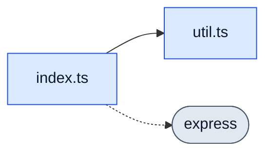

# RepoGraph Intelligence

[](https://github.com/Rajveerx11/repograph-intelligence/actions/workflows/ci.yml)
[](LICENSE)
[](https://nodejs.org/)

RepoGraph Intelligence is an AI-native structural intelligence engine for software repositories.

It analyzes a codebase as a dependency graph, enriches that graph with semantic signals, and exposes repository intelligence through a CLI and MCP server that can answer questions about structure, search, architecture, and change impact.

The goal is not to be another autocomplete tool or chat wrapper. RepoGraph focuses on the missing layer underneath AI-assisted development: durable structural context about how a repository is connected and what a change is likely to affect.

## Status

This project is in active early development.

The repository now contains two implementation tracks:

- A verified Node.js baseline that powers the current CLI, MCP server, intelligence APIs, and tests.
- A Rust Phase 1 core workspace that introduces the production architecture target: Tree-sitter parsing, typed graph construction, SQLite storage, and a modular CLI.

The Node implementation remains the stable runtime surface while the Rust core matures behind the same product contracts.

## What It Does Today

- Recursively scans JavaScript, TypeScript, and Python repositories
- Extracts imports, exports, functions, classes, interfaces, default exports, and Python definitions through a comment- and string-aware source masker that suppresses false positives inside strings, regex, template-literal text, and JSDoc blocks
- Builds a normalized file, symbol, package, and dependency graph
- Calculates structural metrics such as density, cycles, hotspots, coupling, and orphan files
- Performs local semantic search over paths, symbols, imports, comments, and identifiers
- Infers modules, layers, architecture boundaries, and structural risk signals
- Generates compressed AI-ready repository context
- Estimates blast radius for changed files
- Scores dependency risk across the repository
- Simulates refactor/change-set impact
- Analyzes changed files from a Git diff with hardened ref validation that rejects refs starting with `-`, whitespace, or control characters and terminates option parsing with `--`
- Produces structured AI agent context snapshots
- Emits structural guidance warnings for risky files and boundaries
- Runs as a local MCP stdio server for AI assistants
- Summarizes multiple repositories as a workspace
- Analyzes historical repository evolution from Git
- Infers file and module ownership from contribution history
- Identifies security-sensitive architecture risk and critical blast zones
- Generates architecture recommendations for decoupling, stabilization, and boundary cleanup
- Audits dependency manifests across npm, Cargo, `requirements.txt`, and `pyproject.toml` with license classification (permissive, copyleft, proprietary) and optional OSV.dev advisory lookups
- Validates graph schema integrity and missing references
- Creates stable graph snapshots for baselines and CI
- Compares snapshots to detect structural drift
- Produces CI-oriented structural intelligence reports
- Enforces architecture rules as code via `repograph policy` — JSON policy files declare nine rule types (`forbid-import`, `require-import`, `forbid-dependency`, `no-cycles`, `max-imports`, `max-fan-in`, `max-lines`, `layered` for hexagonal / clean-architecture enforcement, and `naming-convention` for regex-validated file paths) with glob targets and per-rule severity, returning a structured pass/fail report and a non-zero exit code for CI gating
- Captures a baseline snapshot via `repograph baseline` and gates PRs on structural drift via `repograph drift` — per-metric thresholds (`--max-new-cycles`, `--max-internal-dep-increase`, `--max-density-increase`, etc.) with `--fail-on-drift` exiting status `4` so CI can block regressions on cycles, dependency growth, and density spikes
- Selects the minimum test set that exercises a diff via `repograph test-select` — reverse-import walk through the graph filtered by configurable test-path patterns; pipes cleanly into a CI step that skips irrelevant tests on every PR
- Overlays LCOV test coverage onto file nodes via `repograph coverage` — parses Istanbul/c8/pytest-cov/jacoco tracefiles, attaches line/branch/function percentages per file, and (with `--rank`) emits a priority list combining `scoreDependencyRisk` with inverse coverage so high-risk low-coverage files surface first
- Compares two graph snapshots and reports public-API surface changes via `repograph api-diff` — every exported symbol classified as added, removed, or changed (symbol-kind transition such as `function` → `class`), with optional `--fail-on-breaking` for release gates
- Exports the dependency graph as GraphViz DOT (`repograph dot`) for Graphviz dot/neato, Gephi, yEd, and any tool that consumes DOT, with color-coded node attributes per file/symbol/package and the same option matrix as the Mermaid exporter
- Exports the dependency graph as a Mermaid flowchart (`repograph mermaid`) that renders inline in GitHub READMEs, GitLab, Notion, and most Markdown viewers, with options for direction, node-type filters, symbol/contain edges, and explicit caps for monorepo-friendly truncation
- Watches a repository in the background and rebuilds the graph incrementally on file changes with a debounced collapse window
- Provides a React Flow graph explorer with a live indicator that streams graph updates over Server-Sent Events as the watcher rebuilds and auto-refreshes the visible graph when the watcher rebuilds
- Lets users open any project from the explorer header by entering a folder path and clicking **Open Project**, which switches the analyzed root, runs analysis synchronously, and renders the new graph
- Renders every action result with a human-readable Summary view alongside a JSON view, with a one-click **Copy JSON for LLM** button for pasting structured context into AI assistants
- Hardens the local web server against CORS bypass and DNS rebinding via Host allowlist, `Sec-Fetch-Site` enforcement, and Origin/Referer validation, and validates project-root switches with `realpath`-resolved path containment checks plus an optional `REPOGRAPH_ALLOWED_ROOTS` allowlist to defeat symlink and prefix-bypass attacks
- Ships as a Docker image on the GitHub Container Registry (`ghcr.io/rajveerx11/repograph-intelligence`) with multi-arch (linux/amd64 + linux/arm64) builds and a non-root runtime user; every tag release also publishes a self-contained Node tarball with a SHA-256 sidecar
- Includes a Rust Phase 1 core workspace for parser, graph, storage, metrics, and CLI foundations

## Phase Coverage

| PRD phase | Status | Current capability |
| --- | --- | --- |
| Phase 1: Repository Structural Engine | In progress | Parser, graph generation, metrics, JSON/SQLite persistence, CLI, React Flow explorer, Rust core scaffold |
| Phase 2: Semantic Intelligence Layer | In progress | Local semantic search, architecture summaries, context compression |
| Phase 3: Change Impact Intelligence | In progress | Blast radius, dependency risk, refactor simulation, Git diff analysis |
| Phase 4: AI Agent and IDE Ecosystem | In progress | MCP stdio server, agent context API, guidance warnings, multi-repo summaries |
| Phase 5: Enterprise and Advanced Intelligence | In progress | History, ownership, security architecture risk, supply-chain audit with OSV advisories, recommendations |
| Phase 6: Operationalization and CI Readiness | In progress | Graph validation, snapshots, baseline + drift gate, policy-as-code (9 rule types), API surface diff, test-selection, coverage overlay, live watch with SSE, CI reports, Mermaid + GraphViz exports, Docker image + multi-arch GHCR releases |

## Quick Start

Requirements:

- Node.js 20 or newer
- npm
- Git
- Rust toolchain for the new Rust core workspace (`cargo`, `rustc`)

Clone and run:

```bash
git clone https://github.com/Rajveerx11/repograph-intelligence.git
cd repograph-intelligence
npm test
```

Or run via Docker, no Node install required:

```bash
docker run --rm -v "$(pwd):/repo" ghcr.io/rajveerx11/repograph-intelligence:latest analyze /repo
docker run --rm -v "$(pwd):/repo" ghcr.io/rajveerx11/repograph-intelligence:latest policy /repo --policy /repo/.repograph/policy.json
docker run --rm -v "$(pwd):/repo" ghcr.io/rajveerx11/repograph-intelligence:latest drift /repo --baseline /repo/.repograph/baseline.json --fail-on-drift
```

Build the image locally with `docker build -t repograph/intelligence:dev .` from a clone of this repo. The image is built and smoke-tested on every PR via CI; the `Release` workflow publishes versioned tags to the GitHub Container Registry on every `v*.*.*` git tag along with a `repograph-intelligence-vX.Y.Z.tar.gz` standalone tarball (bundled Node runtime + production deps) attached to the GitHub Release.

Build the graph explorer UI:

```bash
npm run web:build
```

Run the live graph explorer:

```bash
npm run web
```

Then open `http://127.0.0.1:5173`, paste any project path into the header input, and click **Open Project**. The server analyzes that project, the graph renders, and a watcher streams updates over SSE so saved file edits re-render the graph automatically. Every action result has a Summary/JSON toggle and a **Copy JSON for LLM** button.

To restrict which paths the explorer is allowed to open (recommended for shared environments), set the `REPOGRAPH_ALLOWED_ROOTS` environment variable to a comma-separated list of absolute directories. Symlink escapes and prefix-bypass attempts (`/allowed-evil` against `/allowed`) are rejected. When unset, the explorer accepts any local path the server process can read.

```bash
REPOGRAPH_ALLOWED_ROOTS="/Users/me/code,/Users/me/work" npm run web
```

Use the **Import graph JSON** button in the header to load a previously saved `.repograph/graph.json` for offline viewing without re-analyzing.

Analyze the current repository:

```bash
npm run repograph -- analyze .
```

This writes the normalized graph to:

```text
.repograph/graph.json
```

## CLI Usage

Analyze a repository and persist the graph:

```bash
npm run repograph -- analyze ./repo
```

Print repository metrics:

```bash
npm run repograph -- stats ./repo
```

Search semantically across files:

```bash
npm run repograph -- search ./repo "authentication flow"
```

Explain inferred architecture:

```bash
npm run repograph -- explain ./repo
```

Generate compressed AI context:

```bash
npm run repograph -- context ./repo --out .repograph/context.md
```

Estimate blast radius for a changed file:

```bash
npm run repograph -- impact ./repo src/auth/session.ts
```

Rank dependency risk:

```bash
npm run repograph -- risk ./repo --limit 20
```

Simulate a refactor or change set:

```bash
npm run repograph -- simulate ./repo src/auth/session.ts src/auth/user.ts
```

Analyze changed files from a Git diff:

```bash
npm run repograph -- diff ./repo --base origin/main --head HEAD
```

Print structural guidance warnings:

```bash
npm run repograph -- guide ./repo --changed src/auth/session.ts
```

Generate structured agent context as JSON:

```bash
npm run repograph -- agent-context ./repo --query "authentication flow" --changed src/auth/session.ts
```

Analyze multiple repositories together:

```bash
npm run repograph -- workspace ./service-a ./service-b --json
```

Analyze historical churn and drift:

```bash
npm run repograph -- history ./repo --limit 200
```

Infer file and module ownership:

```bash
npm run repograph -- ownership ./repo
```

Identify security-sensitive architecture risk:

```bash
npm run repograph -- security ./repo --json
```

Generate architecture recommendations:

```bash
npm run repograph -- recommend ./repo --limit 20
```

Validate graph integrity:

```bash
npm run repograph -- validate ./repo
```

Create a stable graph snapshot:

```bash
npm run repograph -- snapshot ./repo --out .repograph/snapshot.json
```

Compare two graph snapshots:

```bash
npm run repograph -- compare --base baseline.json --head current.json
```

Generate a CI report:

```bash
npm run repograph -- ci ./repo --baseline .repograph/snapshot.json --fail-on high --out .repograph/ci-report.json
```

Audit dependency manifests, licenses, and (optionally) OSV advisories:

```bash
npm run repograph -- supply-chain ./repo
npm run repograph -- supply-chain ./repo --online --json --out .repograph/supply-chain.json
```

The `--online` flag queries the public OSV.dev `v1/querybatch` endpoint for known vulnerabilities. Without it the audit stays fully offline and only reports license risk and unpinned versions.

Watch a repository and rebuild the graph on every file change:

```bash
npm run repograph -- watch ./repo --debounce 250 --out .repograph/graph.json
```

Export the dependency graph as a Mermaid flowchart that renders inline in GitHub READMEs, GitLab, Notion, and most modern Markdown viewers:

```bash
npm run repograph -- mermaid ./repo --max-nodes 80 --out .repograph/graph.mmd
```

Options: `--direction LR|TD|RL|BT` (default `LR`), `--symbols` to include function/class nodes, `--no-packages` to hide external packages, `--include-contains` to draw file → symbol edges, `--max-nodes n` / `--max-edges n` to cap output for readability. Without `--out` the diagram prints to stdout. Invalid directions are rejected with a typed error rather than silently coerced.

Sample output (paste any of these blocks into a GitHub README or comment to render natively):



Edge styles distinguish relationship types: `-->` for internal imports, `-.->` for external dependencies, `==>` for explicit exports, `-. ref .->` for symbol references, and `---` for `contains` edges when `--include-contains` is set. Node IDs are stable per-graph aliases (`n1`, `n2`, …) so the output diffs cleanly in CI when used for baseline drift detection.

For toolchains that consume GraphViz DOT (dot/neato/twopi, Gephi, yEd, plantuml/dot tooling), use the sister `dot` command:

```bash
npm run repograph -- dot ./repo --rankdir TB --max-nodes 80 --out diagram.dot
dot -Tsvg diagram.dot > diagram.svg
```

The option matrix mirrors `mermaid` (`--symbols`, `--no-packages`, `--include-contains`, `--max-nodes`, `--max-edges`). `--rankdir` takes `LR/TB/RL/BT` plus `TD` as a Mermaid-style alias for `TB`. Node and edge attributes color-code file/symbol/package types so `dot -Tpng` produces a readable diagram without further configuration.

Enforce architecture rules ("policy as code") against the graph and fail CI on violations:

```bash
npm run repograph -- policy ./repo --policy .repograph/policy.json --fail-on warning
```

Policy files are JSON with nine rule types covering the most common architectural invariants:

- **`forbid-import`** / **`require-import`** — declare which internal imports are banned (or required) between glob-matched file sets.
- **`forbid-dependency`** — ban external packages from a glob-matched file set (`@aws-sdk/*` from `packages/core/**`, etc.).
- **`no-cycles`** — fail when any cycle exists in an optional `scope` glob; rotated cycles are deduplicated.
- **`max-imports`** / **`max-fan-in`** / **`max-lines`** — cap a file's outgoing imports, incoming imports, or line count.
- **`layered`** — declare ordered layers (each with a name + glob); the engine flags every import that flows "upward" against the declared order — ideal for hexagonal / clean-architecture enforcement.
- **`naming-convention`** — assert that files matching a `target` glob also match a regular expression applied to their `basename` (default) or full `path`.

Globs accept `**`, `*`, and `?`. Each rule carries a severity (`info`, `warning`, `error`; default `error`). The CLI exits with status `2` when any violation meets the `--fail-on` threshold so CI can gate merges on structural invariants. See [`examples/policy.example.json`](examples/policy.example.json) for a starter file demonstrating every rule type.

Overlay LCOV test coverage data onto the dependency graph and rank high-risk low-coverage files for prioritized review:

```bash
npm run repograph -- coverage ./repo --lcov coverage/lcov.info --rank --limit 20
```

The parser handles Istanbul, c8, pytest-cov, and jacoco-style LCOV. Path matching tries exact, then suffix, then basename-only (the last is flagged with `weakMatch: true` so consumers can warn). `--rank` produces a priority list combining `scoreDependencyRisk` with the inverse line coverage; files at or above `--coverage-threshold` (default 80%) are excluded from the ranking so the tail of the list stays focused on real risk.

Select the minimum set of test files that exercise a diff via reverse-import walk through the graph:

```bash
npm run repograph -- test-select ./repo --changed "src/auth.ts,src/db.ts"
```

Default test-path patterns cover `test/**`, `tests/**`, `**/__tests__/**`, `**/*.{test,spec}.{js,ts,tsx,jsx,mjs,cjs,py}`, and `**/*_test.{go,py}`. Override with `--patterns "glob,glob"` to match in-house conventions. `--depth n` caps the reverse-walk distance. Output prints a Risk verdict and a sorted list of selected tests; with `--json` the full report is emitted for downstream automation. CI pipelines can pipe this into the test runner to skip irrelevant tests and cut feedback time.

Capture a baseline snapshot for drift detection, then run a drift gate on subsequent PRs:

```bash
npm run repograph -- baseline ./repo
npm run repograph -- drift ./repo --baseline .repograph/baseline.json --fail-on-drift
```

`baseline` writes `.repograph/baseline.json` by default (overridable with `--out`). `drift` compares the current graph against that file and applies per-metric thresholds: `--max-new-cycles n` (default `0` — any new cycle fails), `--max-added-files`, `--max-removed-files`, `--max-internal-dep-increase`, `--max-external-dep-increase`, `--max-density-increase`, `--max-new-packages`. With `--fail-on-drift` the CLI exits status `4` when any threshold is breached. Improvements (reductions) never count as drift, even with a zero-tolerance cap. The report includes the full `compareGraphSnapshots` diff so CI bots can render a human summary of what changed structurally.

Compare two graph snapshots and report changes to the public API surface — every exported symbol classified as added, removed, or changed:

```bash
npm run repograph -- api-diff --base baseline.json --head current.json --fail-on-breaking
```

Useful for PR review automation and release-notes generation. The diff identifies `(filePath, exportedName)` pairs and reports a per-file summary, an overall summary with a `breaking` count (removed + changed), and dedicated lists for files whose exports appeared or disappeared entirely. With `--fail-on-breaking` the CLI exits with status `3` when the breaking count is non-zero so CI can gate releases on API stability.

The watcher collapses bursts of file changes inside a debounce window, emits structured events for tooling, and writes the latest graph back to disk. Press `Ctrl+C` to stop.

Start the MCP server:

```bash
npm run mcp
```

Run the Rust Phase 1 core when a Rust toolchain is installed:

```bash
cargo run -p repograph -- analyze ./repo
cargo run -p repograph -- stats ./repo
```

Every intelligence command supports JSON output where useful:

```bash
npm run repograph -- impact ./repo src/auth/session.ts --json
```

## Core Concepts

RepoGraph represents a repository as a graph:

- File nodes represent source files
- Symbol nodes represent functions, classes, interfaces, and definitions
- Package nodes represent external dependencies
- Edges represent containment, imports, and dependency relationships

On top of that graph, RepoGraph derives intelligence:

- Structural metrics identify coupling and graph shape
- Semantic search maps natural-language queries to relevant files
- Architecture inference groups files into modules, layers, and boundaries
- Impact analysis walks reverse dependency paths to estimate downstream blast radius
- Risk scoring ranks files by fan-in, fan-out, external dependencies, symbols, and cycles
- Agent context packages summaries, search hits, impact, guidance, and compressed context for AI tools
- Guidance warnings highlight high-risk graph nodes, cycles, boundary pressure, and large blast radius
- History analysis uses Git churn, commit frequency, contributors, and monthly trends to identify evolution pressure
- Ownership intelligence maps files and modules to likely maintainers from contribution history
- Security intelligence highlights sensitive paths, wide external dependency surfaces, cycles, and critical blast zones
- Recommendation generation turns structural signals into prioritized architecture actions
- Supply-chain auditing parses dependency manifests, classifies licenses, flags unpinned versions, and (optionally) cross-checks OSV.dev for advisories
- Live watch mode rebuilds the graph incrementally on file changes and pushes updates to the explorer over Server-Sent Events
- Graph validation checks schema integrity, duplicate ids, duplicate paths, and missing edge endpoints
- Snapshots create stable fingerprints for baseline comparison
- CI reports combine validation, security findings, recommendations, and baseline drift into pass/fail output

## AI and IDE Integration

RepoGraph includes an MCP-compatible stdio server intended for local AI assistants, coding agents, and future IDE integrations.

Start it with:

```bash
npm run mcp
```

The server exposes these tools:

| Tool | Purpose |
| --- | --- |
| `repograph_analyze` | Return repository metrics, architecture, and package summary |
| `repograph_search` | Search files by local semantic relevance |
| `repograph_context` | Return AI-ready context with summaries, matches, guidance, and impact |
| `repograph_impact` | Estimate blast radius for changed files |
| `repograph_guidance` | Return structural warnings and recommendations |
| `repograph_history` | Analyze repository evolution from Git history |
| `repograph_ownership` | Infer file and module ownership |
| `repograph_security` | Identify security-sensitive architecture risk |
| `repograph_supply_chain` | Audit dependency manifests, license risk, and optional OSV advisories |
| `repograph_recommend` | Generate architecture improvement recommendations |
| `repograph_mermaid` | Export the dependency graph as a Mermaid flowchart for Markdown viewers |
| `repograph_dot` | Export the dependency graph as GraphViz DOT source |
| `repograph_policy` | Evaluate architecture rules (forbid-import, forbid-dependency, no-cycles, max-imports, max-lines) and return a pass/fail report |
| `repograph_api_diff` | Compare two RepoGraph snapshots and report added, removed, and changed public-API exports |
| `repograph_coverage` | Overlay LCOV coverage on file nodes and optionally rank files by combined risk and low coverage |
| `repograph_test_select` | Select the minimum test file set that exercises a list of changed files |
| `repograph_drift` | Compare a baseline against the current state and flag drift using per-metric thresholds |
| `repograph_validate` | Validate graph schema and references |
| `repograph_snapshot` | Create a stable graph intelligence snapshot |
| `repograph_compare` | Compare two graph snapshots |
| `repograph_ci` | Produce a CI-oriented structural intelligence report |

The MCP server is intentionally local-first. It analyzes source on demand and does not require cloud services or model provider credentials.

## Project Layout

```text
apps/
  cli/
    src/main.rs             Rust Phase 1 CLI entrypoint
  web/
    src/main.tsx            React Flow graph explorer
crates/
  shared_types/             Rust graph, parser, node, edge, and metric contracts
  parser_engine/            Tree-sitter-backed repository parser
  graph_engine/             Directed graph construction and structural metrics
  storage_engine/           SQLite graph store abstraction
packages/
  shared-types/
    src/index.ts            TypeScript graph contracts for UI/integrations
  cli/
    src/index.js            CLI entrypoint
  mcp/
    src/server.js           MCP stdio server
  core/
    src/
      agent.js              AI context and guidance APIs
      architecture.js       Architecture inference
      extractors/
        javascript.js       JS/TS symbol, import, export, reference extraction
        python.js           Python module and definition extraction
        source-masker.js    Comment- and string-aware source masker for accurate extraction
      graph.js              Normalized graph builder
      history.js            Historical churn and evolution analysis
      impact.js             Phase 3 impact intelligence
      metrics.js            Repository metrics
      ownership.js          Ownership inference from history
      operations.js         Validation, snapshots, comparison, CI reports
      recommendations.js    Architecture recommendations
      repository.js         Repository analysis orchestration with atomic file reads
      scanner.js            Recursive source scanner
      semantic.js           Local semantic index/search
      security.js           Security architecture risk analysis
      storage.js            Graph persistence
      summaries.js          Repository summaries and context compression
      supply-chain.js       Manifest parsing, license classification, OSV advisory lookups
      watch.js              Recursive watcher with debounced incremental graph rebuilds
      workspace.js          Multi-repository workspace summaries
test/
  core.test.js              Core behavior tests
  features.test.js          Tests for the source masker, supply-chain audit, and watch lifecycle
  fixtures/                 Small multi-language fixture repository
docs/
  PRD.md                    Product requirements document
  GRAPH_SCHEMA.md           Current graph and snapshot schema notes
  RUST_CORE.md              Rust Phase 1 architecture and verification notes
```

## Development

Run syntax checks:

```bash
npm run check
```

Run tests:

```bash
npm test
```

Run dependency audit:

```bash
npm run audit
```

Build the graph explorer:

```bash
npm run web:build
```

Run the CLI locally:

```bash
npm run repograph -- help
```

When a Rust toolchain is installed, validate the Rust core with:

```bash
cargo test --workspace
```

The verified Node runtime intentionally stays small and inspectable while the Rust graph engine matures into the production core.

## Roadmap

Near-term priorities (v0.4):

- VS Code extension that surfaces blast-radius, risk score, owners, and the MCP tool surface inline
- GitHub App / PR bot that posts the policy + api-diff + drift verdict automatically on every pull request
- Tree-sitter-backed JS/TS extraction to replace the regex+masker pipeline and unlock accurate function-level call edges
- Additional language parsers (Go, Rust, Java, C#) on the same tree-sitter foundation
- Cache OSV advisory responses on disk so repeated supply-chain audits stay quick offline

Mid-term priorities:

- True function-to-function call graph built on top of the tree-sitter parser
- Symbol-level rename impact and codemod-ready edit plans
- YAML loader for `.repograph/policy.yaml` (the engine is YAML-ready; only the loader is pinned to JSON for v1)
- Conversational repo agent inside the web explorer that uses the MCP server as its tool backend

Longer-term priorities:

- True incremental indexing where the watcher mutates the graph in place instead of rebuilding from scratch
- Deeper multi-repository service intelligence with cross-language edges (TS ↔ Python via OpenAPI / gRPC contracts)
- Tauri desktop packaging around the web explorer and Rust core
- Rust core feature parity with the Node runtime as the production engine

## Design Principles

- The graph is infrastructure, not the product.
- Repository intelligence should be explainable and inspectable.
- Local analysis should work before cloud or model-backed features are required.
- AI context should be grounded in structural facts, not only embeddings.
- Every feature should help developers understand risk, architecture, or change impact.

## Contributing

Contributions are welcome, especially around parser support, graph algorithms, architecture rules, CLI ergonomics, MCP integrations, and test fixtures.

Before opening a pull request:

```bash
npm run check
npm test
```

For larger changes, please include a short explanation of the repository behavior being modeled and the tradeoffs in the implementation. See [CONTRIBUTING.md](CONTRIBUTING.md) for the full contributor guide.

## License

MIT. See [LICENSE](LICENSE).
